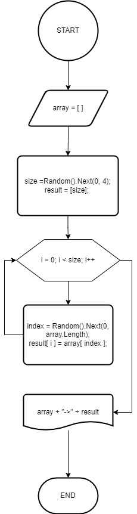

Описание проекта
=
* Создал локальный репозиторий и репозиторий на GitHub и связал их.
* Описал алгоритм для решения задачи с помощью блок-схемы. 

    > 
* Перевёл блок-схему в код:
  1. Задал определённый массив;
  2. Для решения задачи создал метод;
  3. В методе описал логику решения:
     1. Задал длину для итогового массива с помощью *Random().Next(от 0 до 3)*;
     2. Данную длину использовал для создания массива.
     3. Загнал его в цикл, где на каждой итерации с помощью того же *Random()* генерировал псевдослучайные числа от 0 до длины исходного массива.
     4. Присваивал сгенерированное значение индексу исходного массива и записывал это значение в элемент итогового массива.
     5. После выводил результат на экран.
* Залил результат на удалённый репозиторий.