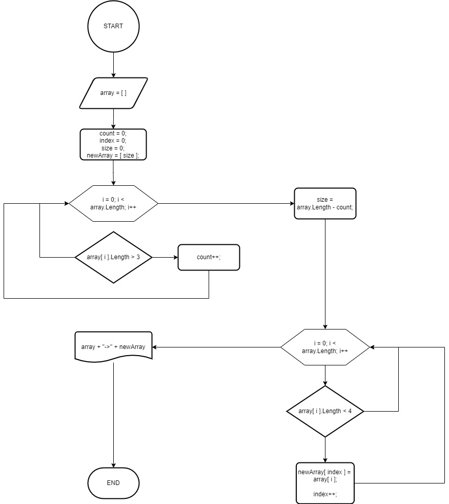

Описание проекта
=
* Создал локальный репозиторий и репозиторий на GitHub и связал их.
* Описал алгоритм для решения задачи с помощью блок-схемы. 

    > 
* Перевёл блок-схему в код:
  1. Задал определённый массив;
  2. Для решения задачи создал метод;
  3. В методе описал логику решения:
     1. Определил количество элементов, неотвечающих условию, с помощью *foreach*;
     2. На основе этого определил длину итогового массива.
     3. Загнал оба массива в цикл *for*, где на каждой итерации проверял необходимое условие. 
     4. При выполнении условия присваивал значение элемента исхдоного массива итоговому.
     5. После вывел результат на экран.
* Залил результат на удалённый репозиторий.